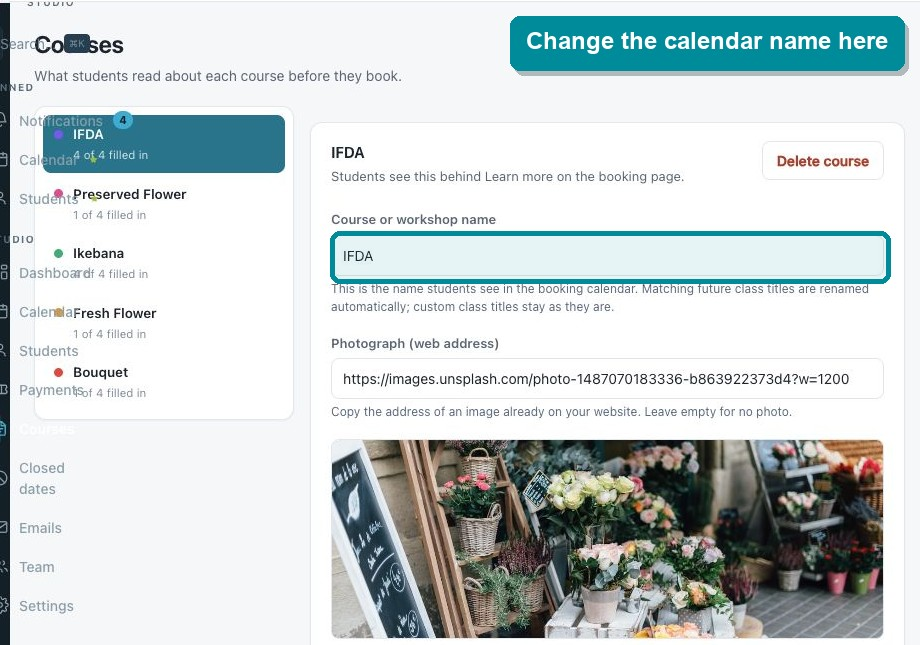
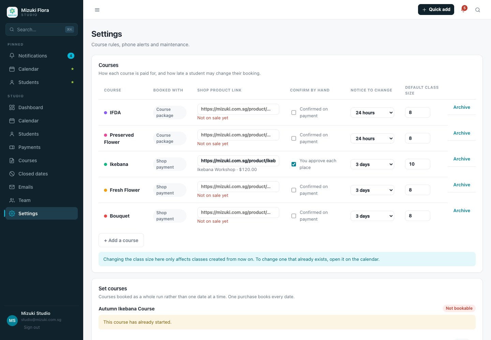
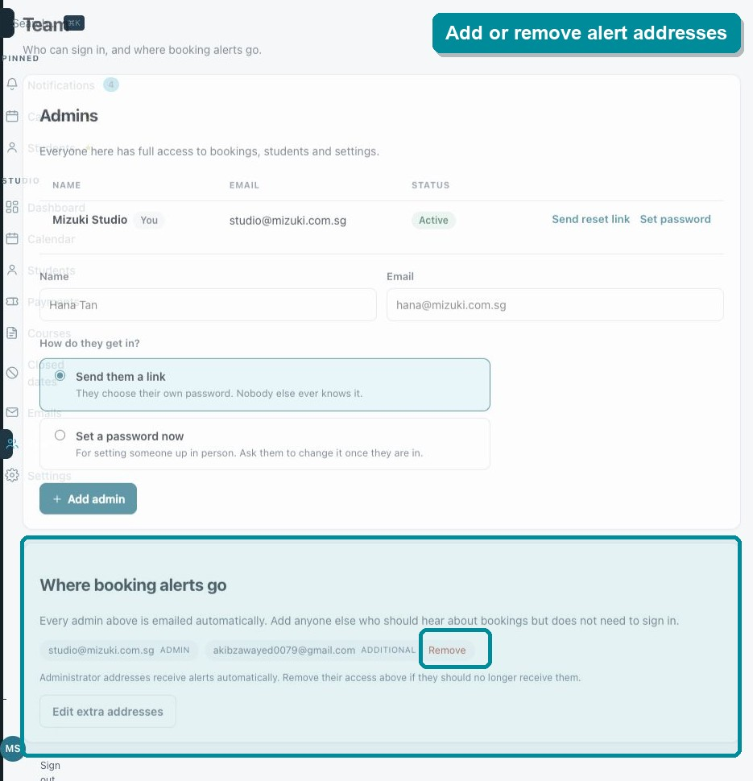
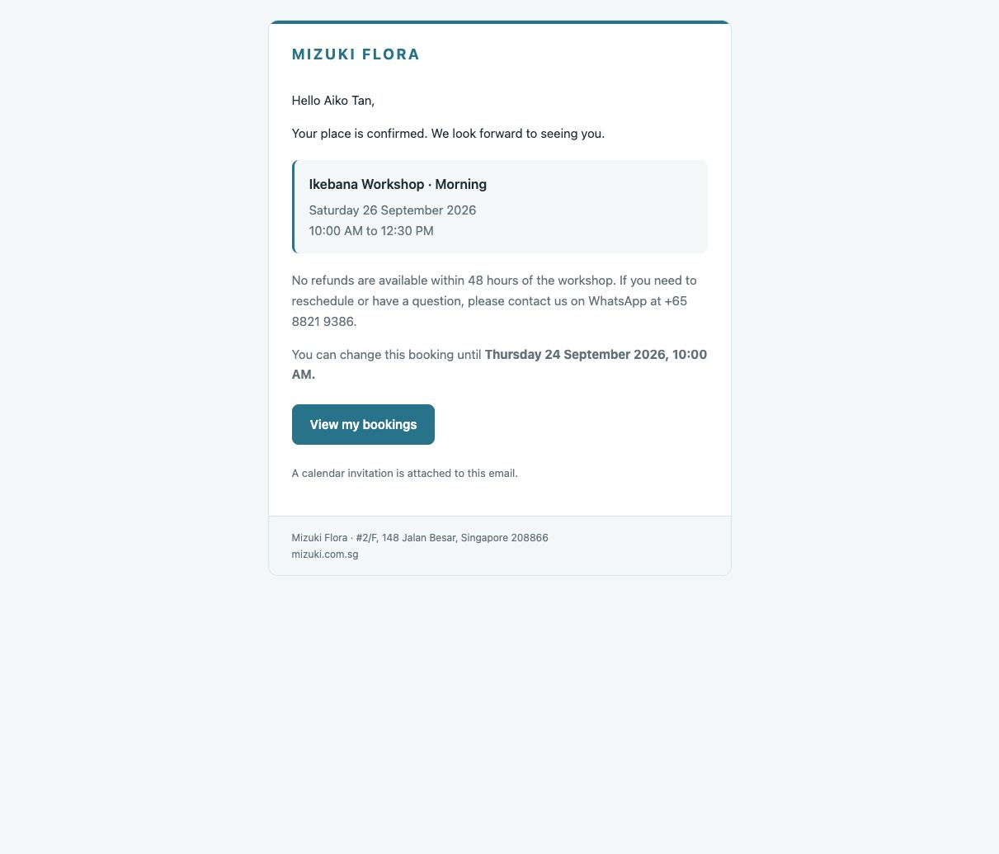
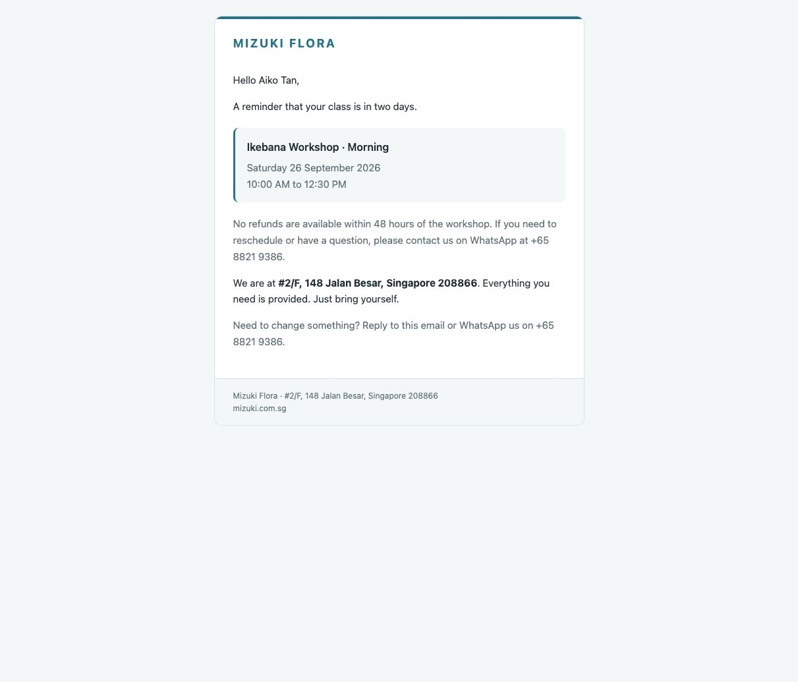
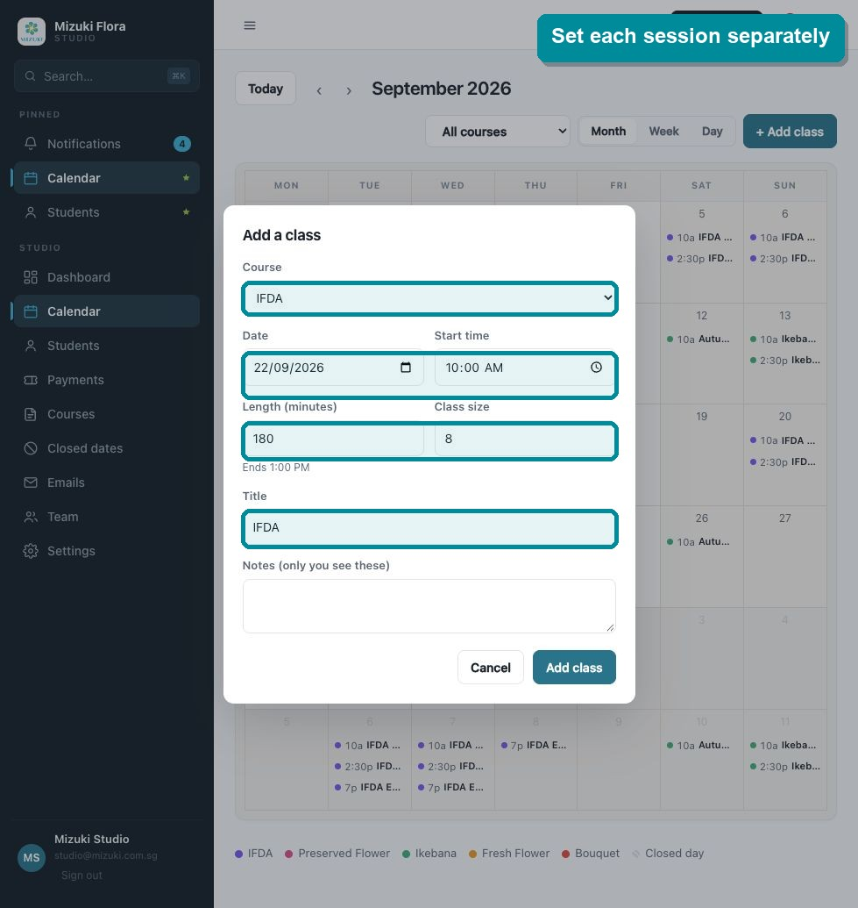
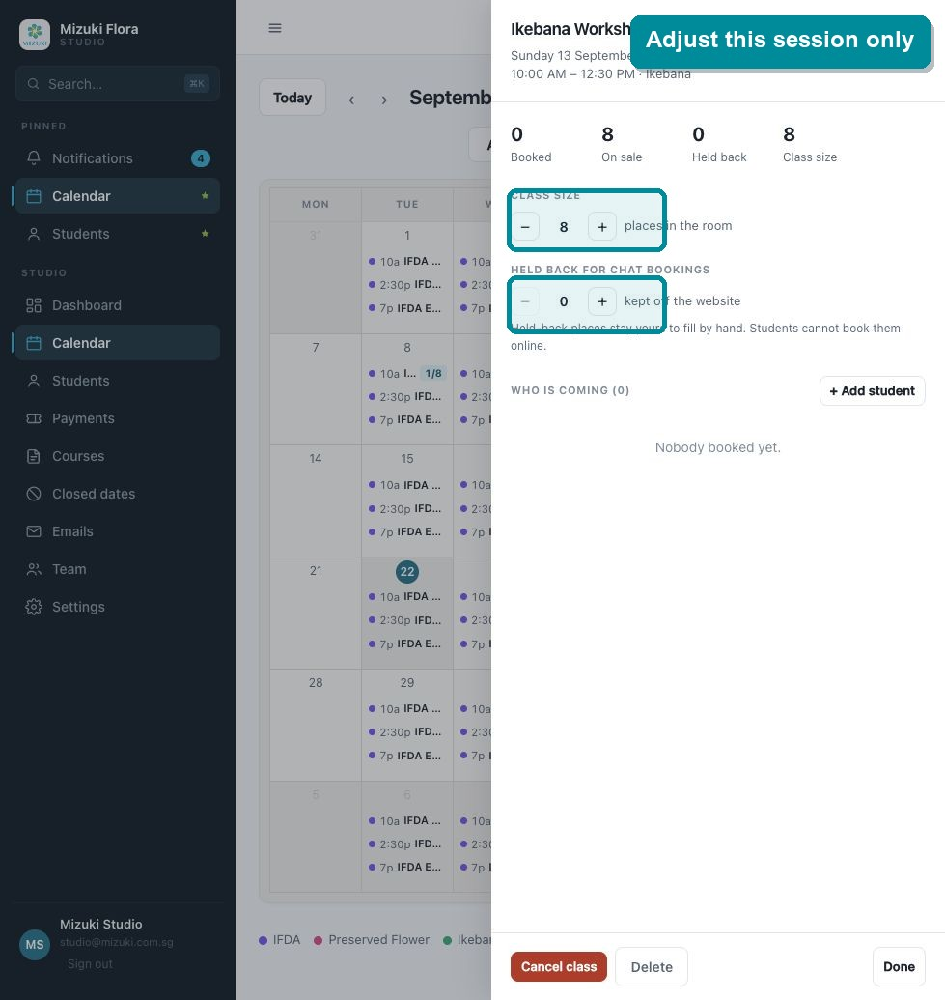
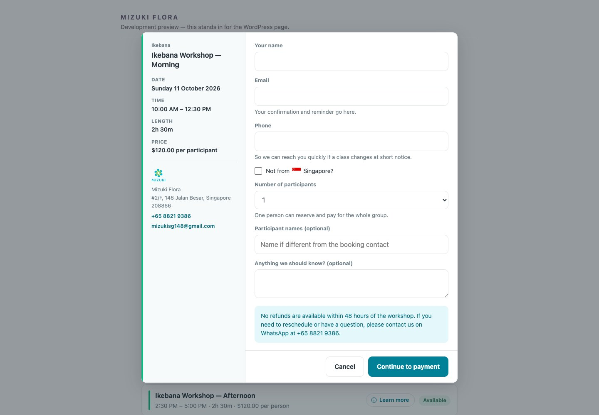

# Mizuki booking system update

Hi Mizuki team,

Thank you for explaining the booking requirements so clearly. I understand that you need two booking journeys:

1. Course booking for students who already have a course package

2. Workshop booking for one off sessions where students choose a date and time, pay during booking, and receive automatic messages

I have updated the system to support both journeys. Here is how each part now works.

## 1. Changing a course or workshop name

Open **Courses**, select the course on the left, change **Course or workshop name**, then select **Save changes**.

The new name is shown to students in the booking calendar. Future classes that still use the original course name are updated automatically. A class with its own custom title keeps that custom title.

## 2. Connecting the WooCommerce product

First create or open the workshop product in **WordPress**, then copy its public product page link.

In the Mizuki Studio console, open **Settings**. Add or find the workshop, choose **Shop payment**, and paste the link into **Shop product link**.

The booking system checks the link with WooCommerce and automatically imports the internal product code, product name, and current price. The price is refreshed from WordPress and shown in the workshop calendar and booking form.

The system shows **Not on sale yet** until a valid product link is connected. This prevents a paid workshop from accepting a booking without a working checkout.

Existing workshops that already have a product code are upgraded automatically when WordPress can resolve that product.

## 3. Choosing who receives booking alerts

Open **Team** and look under **Where booking alerts go**.

Every active administrator receives booking alerts automatically. Additional addresses can also receive alerts without receiving access to the studio console.

Use **Edit extra addresses** to add an address. Use **Remove** beside an additional address when it should stop receiving alerts. To stop alerts for an administrator, remove that administrator's access in the section above.

This routing applies to every course and workshop, including IFDA, Ikebana, Fresh Flower, Preserved Flower, and Bouquet bookings.

## 4. Student confirmation and reminder emails

Students now receive the correct message for the booking journey.

1. A course student receives a confirmation when the course booking is completed.

2. A paid workshop student is sent to WooCommerce checkout. Their place is held while payment is completed. The confirmation is sent when payment is accepted and the booking is confirmed.

3. A reminder is sent automatically two days before the course or workshop.

4. The confirmation includes a calendar invitation.

The workshop confirmation and reminder also include the refund and contact wording requested.

The email connection can be checked under **Settings** in **Connected services**. The status shows whether sending is ready, and **Test email key** confirms delivery before accepting live bookings. If the connection is not ready, the system now shows the problem instead of failing silently.

## 5. Creating regular and seasonal workshops

Add the workshop once as a paid course in **Settings**, paste its WooCommerce product page link, and add its description and student information in **Courses**.

For every available workshop time, open **Calendar** and select **Add class**. Choose the workshop, then set the date, start time, duration, participant limit, and title.

This means a morning session can have eight participants while an afternoon session of the same workshop can have twelve.

## 6. Changing the participant limit for one session

Open the session from the calendar and use the controls under **Class size**.

The change applies only to that selected date and time. It does not change the capacity of the other workshop sessions.

The **Held back** control can reserve places for students who book through WhatsApp or another manual channel. Held places are not offered online.

## 7. What the workshop customer experiences

The workshop customer can:

1. View available dates and times

2. Choose one session

3. See the current WooCommerce price and whether places are still available

4. Choose how many people are attending

5. Enter their contact details without creating a password

6. Continue directly to WooCommerce checkout and pay

7. Receive an automatic confirmation after payment

8. Receive an automatic reminder two days before the workshop

The system tracks capacity for each session independently. A booking for three people reserves three places together, so one session cannot use the remaining places from another session or become overbooked.

The customer is also shown this policy before checkout and in the email messages:

**No refunds are available within 48 hours of the workshop. If you need to reschedule or have a question, please contact us on WhatsApp at +65 8821 9386.**

You do not need a separate automatic refund or rescheduling function for workshops. The message directs the customer to contact the studio as requested.

These updates are included in the latest booking system and WordPress plugin package.
